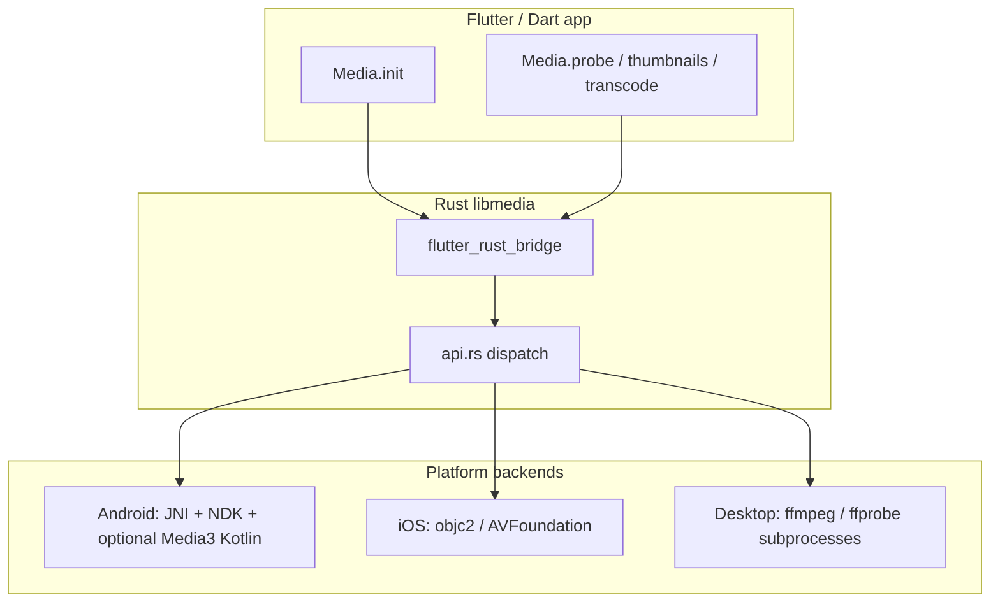

# Media packages — API reference and platform behavior

This document describes the **public Dart API**, **Rust bridge surface**, and how **probe**, **thumbnails**, **timeline**, **transcode**, and **estimates** behave on each platform.

## Package layout

| Package | Role |
|--------|------|
| [**media_dart**](media_dart/) | Core library: Rust native code via **flutter_rust_bridge**, pure Dart **estimates**, no Flutter SDK. |
| [**media_flutter**](media_flutter/) | Flutter plugin: registers Android Gradle module so **Media3** / JNI glue loads; **re-exports** `media_dart`. |
| [**media**](lib/media.dart) (root) | **Shim** package name **`media`**: re-exports `media_flutter` for legacy `path: …/packages/media` + `package:media`. Requires Flutter SDK. |

**New projects:** depend on `media_dart` and/or `media_flutter` directly. Use the shim only for legacy path dependencies.

### `package:media_dart` exports (`lib/media_dart.dart`)

| Export | From |
|--------|------|
| **`Media`** | `media_facade.dart` (recommended entry point) |
| **`RustLib`** | `frb_generated.dart` |
| **`probeVideo`**, **`thumbnailImage`**, **`thumbnailSaveToPath`**, **`timelineThumbnails`**, **`transcodeVideo`** | `bindings/api.dart` |
| **`VideoProbe`**, **`TranscodeProgress`**, **`ThumbnailFormat`**, **`TimelineThumbnail`** | `bindings/api.dart` |
| **Estimates** (`VideoPreset`, **`estimateCompressedSize`**, **`estimateEncodeWallClock`**, **`TranscodeCalibration`**, etc.) | `estimates.dart` (full library export) |

---

## End-to-end flow

1. **`Media.init()`** loads `libmedia` (`RustLib.init`). On Flutter mobile, the library is normally loaded via **native assets** / embedding; you can pass **`libraryPath`** for local dev.
2. Each **`Media.*` call** goes through generated FRB bindings into **`api.rs`**, which **`cfg`-dispatches** to `platform/android`, `platform/ios`, or `platform/desktop`.
3. **Android** JNI uses **`JNI_GetCreatedJavaVMs`** (and optional `JNI_OnLoad`) so Dart/Rust can call Java **`MediaExtractor`**, **`MediaMetadataRetriever`**, and (with **media_flutter**) Kotlin **Media3 Transformer**.

**Pure Dart (estimates):** `estimates.dart` and **`TranscodeCalibration`** never call Rust; they only consume **`VideoProbe`** from a prior **`probe`**.

---

## Dart API surface

### `Media` facade (`media_dart/lib/src/media_facade.dart`)

Call **`Media.init()` once** before any other method.

| Method | Returns | Purpose |
|--------|---------|---------|
| **`init`** | `Future<void>` | Load native library; optional `packageRoot` / `libraryPath`. |
| **`probe`** | `Future<VideoProbe>` | Container + stream metadata for a file path or `content://` URI (Android). |
| **`thumbnailImage`** | `Future<Uint8List>` | Single frame as encoded bytes (PNG / JPEG / WebP). |
| **`thumbnailSaveToPath`** | `Future<String>` | Same frame written to disk; returns resolved path. |
| **`thumbnailPng`** | `Future<Uint8List>` | Convenience wrapper for PNG. |
| **`timelineThumbnailsStream`** | `Stream<TimelineThumbnail>` | Evenly spaced frames over duration; events emitted as each frame is ready. |
| **`transcodeVideoStream`** | `Stream<TranscodeProgress>` | Re-encode / export with progress updates. |

### Low-level FRB API (`media_dart/lib/src/bindings/api.dart`)

**Do not edit** `api.dart` or `frb_generated.dart` by hand. Regenerate after changing `rust/media/src/api.rs` (see [media_dart/README.md](media_dart/README.md)).

Rough equivalents: **`probeVideo`**, **`thumbnailImage`**, **`thumbnailSaveToPath`**, **`timelineThumbnails`**, **`transcodeVideo`**. Prefer **`Media.*`** in app code.

### `RustLib` (`frb_generated.dart`)

Used internally for initialization; advanced embedding may call **`RustLib.init`** directly.

---

## Data types

### `VideoProbe`

| Field | Meaning |
|-------|---------|
| `durationMs` | Container duration when known. |
| `width`, `height` | **Display-oriented** size when rotation is applied (see Android below). |
| `videoBitrate`, `audioBitrate` | Bitrates from format metadata when present. |
| `frameRate` | When reported by demuxer / probe. |
| `videoCodec`, `audioCodec` | MIME-style strings (e.g. `video/hevc`, `audio/mp4a-latm`). |

### `ThumbnailFormat` (`png` \| `jpeg` \| `webp`)

**WebP** thumbnails on Android may preview poorly in some **`Image.memory`** + Impeller combinations; the file on disk can still be valid.

### `TimelineThumbnail`

| Field | Meaning |
|-------|---------|
| `index` | 0-based frame index in the sequence. |
| `timeSec` | Nominal source time for that frame. |
| `imageBytes` | Encoded image (`ThumbnailFormat`). |

### `TranscodeProgress`

| Field | Meaning |
|-------|---------|
| `phase` | Opaque phase label (e.g. starting, encoding, done). |
| `fraction` | Rough progress 0…1. |
| `message` | Optional human-readable status (platform-dependent). |

---

## Estimates & calibration (`media_dart/lib/src/estimates.dart`)

Pure Dart — **no native calls**.

| API | Role |
|-----|------|
| **`VideoPreset`** | Preset tiers (`p360` … `p1080`) with target long edge and nominal video bitrate. |
| **`estimateCompressedSize`** | Output size from duration × effective bitrates + small container fudge. |
| **`estimateEncodeWallClock`** | Wall-clock encode estimate: uses **`TranscodeCalibration`** per preset when available, else a resolution-aware heuristic (`defaultTranscodeEncodeK` differs by OS in `transcode_encode_k_io.dart`). |
| **`TranscodeCalibration`** | Records **`wallMs / sourceDurationMs`** per preset (EMA). **`exportJson` / `importJson`** for persistence. |

**Calibration** is the realistic path: after each successful transcode, call **`recordObservation`** and persist JSON so future estimates use **measured** seconds-per-second-of-media for that preset on **this device**.

---

## Platform behavior

### Desktop (Linux / macOS / Windows)

| Feature | Implementation | Notes |
|---------|----------------|--------|
| **Probe** | **`ffprobe`** JSON | Normally **bundled** via [`hook/build.dart`](media_dart/hook/build.dart) next to `libmedia`; else `PATH`. |
| **Thumbnail / timeline** | **`ffmpeg`** frame extraction + encode | Same as probe. |
| **Transcode** | **`ffmpeg`** (e.g. `libx264`, AAC; macOS may use VideoToolbox-style paths in implementation) | Progress streamed from stderr / parse logic in Rust. |

**Flow:** Rust spawns **`ffprobe`** / **`ffmpeg`** as subprocesses; streams and async I/O bridge to Dart.

---

### Android

| Feature | Implementation | Notes |
|---------|----------------|--------|
| **Probe** | **`MediaExtractor`** + **`MediaFormat`** via JNI | **Width/height** use **`rotation-degrees`**: for 90°/270°, dimensions are **swapped** so they match **display** orientation (portrait phone video). |
| **Thumbnail** | **`MediaMetadataRetriever`** + **`Bitmap.compress`** | **Still images** use **`BitmapFactory.decodeFile`**. **`timeSec`** clamped using reported duration; multiple **`getFrameAtTime`** fallbacks if a timestamp returns null. |
| **Timeline** | Same retriever, one open per export; frames at evenly spaced times | Duration from extractor or retriever metadata if needed. |
| **Transcode** | If **`MediaTranscoder`** class is loadable (**media_flutter**): **Media3 Transformer** on main looper; else NDK **remux** (stream copy, not a real re-encode) | Output **H.264 + AAC** when Media3 runs. **HDR:** `TransformationRequest` uses **tone-map HDR → SDR (OpenGL)** so output stays H.264 instead of falling back to HEVC HDR encoders that often fail on color format. **Sizing:** uses the same **display** dimensions as probe (rotation-aware) so **`maxWidth`** matches long-edge scaling (no pillarboxing from wrong aspect). |

**JNI:** Flutter often loads the VM without `JNI_OnLoad` on the Rust library path; the code uses **`libnativehelper`** + **`JNI_GetCreatedJavaVMs`** to attach and find **`Application` `Context`**. Plugin classes (**`MediaTranscoder`**) must be loaded with the **app class loader** (`find_app_class`).

**Gradle:** Force a **single** `androidx.media3` version across the app (see `media_flutter/android/build.gradle.kts` **resolutionStrategy**) to avoid **`NoSuchMethodError`** on mixed Media3 versions.

---

### iOS

| Feature | Implementation | Notes |
|---------|----------------|--------|
| **Probe** | **AVFoundation** (`AVAsset` / tracks) | Dimensions from natural size / preferred transform as implemented in `ios.rs`. |
| **Thumbnail / timeline** | **`AVAssetImageGenerator`** (and related) | **WebP** output is not supported in-tree; use PNG or JPEG. |
| **Transcode** | **`AVAssetExportSession`** (preset chosen from **`max_width`**) | Progress approximated from export status / time observers in Rust glue. |

**Flow:** Blocking work runs on a thread pool from Dart’s perspective (`spawn_blocking`-style) while FRB completes the async future/stream contract.

---

## Transcode parameters (all platforms)

- **`videoBitrateKbps`**: Target video bitrate (implementation may clamp to device limits).
- **`maxWidth`**: **Longest side cap** (even dimensions); scaling follows desktop-style `min(maxWidth, source long edge)` semantics in Rust before calling platform code.
- **`audioBitrateKbps`**: Target AAC (or platform default) audio bitrate where applicable.

---

## Regenerating bindings

After editing **`rust/media/src/api.rs`** (or FRB config), run the project’s **flutter_rust_bridge** codegen (see **media_dart/README.md**). Do **not** hand-edit **`frb_generated.*`**, **`api.dart`** (generated sections), etc.

---

## Build tooling (for maintainers)

| Concern | Location |
|--------|----------|
| **Pub workspace + Melos** | Root `pubspec.yaml`: `dart pub get`, `dart run melos bootstrap`, `dart run melos run <script>`. Scripts include `analyze`, `test` / `test:flutter`, `codegen`, `collect-native`, and `build-example-*` release builds. |
| Native hook (`localBuild`, `usePrebuild`, GitHub prebuilts) | `media_dart/hook/build.dart` |
| Prebuilt layout | `platform-builds/README.md` (repo root; `platform-builds/<os>/<triple>/`) |
| `collect-native` CLI | `tool/cli/` (Dart package name `media_cli`; also `dart run melos run collect-native --no-select`) |
| Fastforge example config | `media_flutter/example/distribute_options.yaml` |

---

## Related files (for maintainers)

| Area | Location |
|------|-----------|
| FRB API & types | `media_dart/rust/media/src/api.rs` |
| Android JNI / NDK / transcode dispatch | `media_dart/rust/media/src/platform/android.rs` |
| Kotlin Media3 | `media_flutter/android/.../MediaTranscoder.kt`, `MediaJni.kt` |
| iOS | `media_dart/rust/media/src/platform/ios.rs` |
| Desktop FFmpeg | `media_dart/rust/media/src/platform/desktop.rs` |
| Example app | `media_flutter/example/` |
